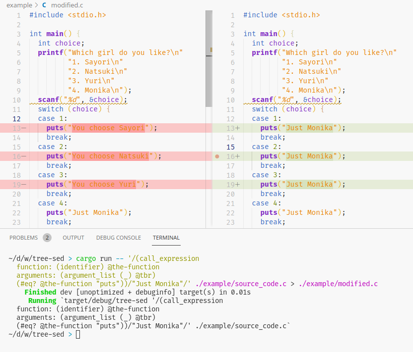

# tree-sed

Manpulate ast tree like `sed`.

## Example

Using `sed`-like grammer to replace `puts` argument.

```bash
$ cargo run -- /(call_expression
  function: (identifier) @the-function
  arguments: (argument_list (_) @tbr)
  (#eq? @the-function "puts"))/"Just Monika"/ ./example/source_code.c
```



## TODO

- [ ] Implement more argument to compatible to `sed`
- [ ] Implement more sed script's function
